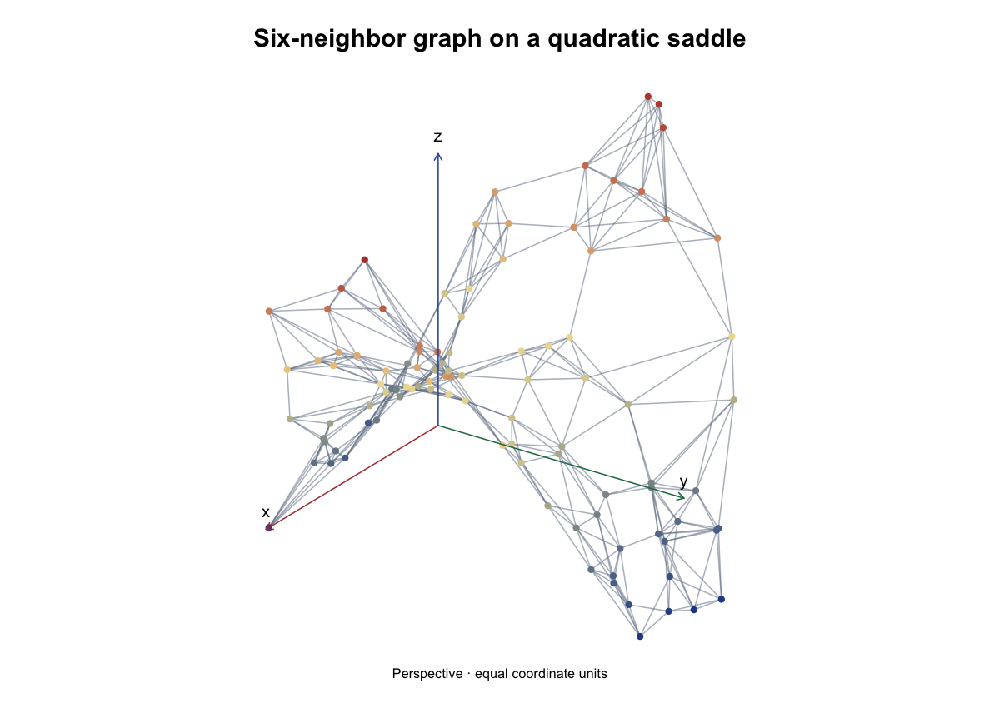

# dgraphs

`dgraphs` constructs and analyzes graphs derived from numerical observations.
It includes mutual and shared-neighbor graphs, intersection and geodesic
nearest-neighbor graphs, radius and adaptive-radius graphs, and
minimum-spanning-tree completion. Utilities for conversion, pruning,
diagnostics, spectral embedding, endpoints, and paths are also provided.

## Install the version used here

This page and the [website](https://pgajer.github.io/dgraphs/) document
**development version 0.3.0.9000**. CRAN currently supplies **0.2.0**
(checked 15 September 2026), which has an older public API. Changing the
repository version does not publish a CRAN release.

For all examples on this page, install the development package, including
its offline guides. A C++17 toolchain and Pandoc are required for this source
installation (Rtools on Windows; Xcode command-line tools on macOS):

```r
install.packages(c("remotes", "knitr", "rmarkdown"))
remotes::install_github("pgajer/dgraphs", dependencies = NA,
                        build_vignettes = TRUE)
library(dgraphs)
packageVersion("dgraphs")  # 0.3.0.9000
```

The guides include static figures without optional viewers. For the 3D
quadratic-form galleries, install `htmlwidgets` and `rgl`, then install the
pinned viewer before building dgraphs:

```r
install.packages(c("htmlwidgets", "rgl"))
remotes::install_github("pgajer/ivue@a952ab6816636a19f2038ba0709181608b71770d",
                        dependencies = NA)
```

To stay on CRAN 0.2.0, use this separate, release-compatible example:

```r
install.packages("dgraphs")
library(dgraphs)
set.seed(1)
x <- matrix(rnorm(80), ncol = 2)
graph <- create.mknn.graph(x, k = 4)
print(graph)
```

The remaining examples use the development installation above. Breaking
changes are described in [NEWS](https://pgajer.github.io/dgraphs/news/index.html).

## Example

```r
library(dgraphs)

set.seed(1)
x <- matrix(rnorm(80), ncol = 2)
graph <- create.mknn.graph(x, k = 4)

nrow(graph.edges(graph))
```

For standard graph examples, choose a type with `create.graph()`:

```r
chain <- create.graph("chain", n = 10, span = 2, labels = 101:110)
circle <- create.graph("circle", n = 20, sampling = "uniform",
                        edge.length = "chord")
graph.edges(chain)
circle$metadata$coordinates
```

Other types are `"empty"`, `"complete"`, `"cycle"`, `"complete_bipartite"`,
`"star"` and `"random"`. Type-specific arguments are documented together in
`help("create.graph")` and the function guide.

Distances, stored routes, and plotting share the graph representation:

```r
D <- graph.geodesic.distances(chain, vertices = c(1, 10))
paths <- create.path.graph(chain, h.values = c(2, 5))
get.shortest.path(paths[["h_5"]], from = 10, to = 1)
xy <- plot(chain, vertex.values = seq_len(graph.order(chain)))
plot(chain, coordinates = xy, vertex.colors = "navy")
```

For an end-to-end introduction to graph construction, connectivity repair,
parameter sequences, conversion, and diagnostics, run:

```r
vignette("data-derived-graph-workflow", package = "dgraphs")
```

## Guides

- [Finding your way around dgraphs](https://pgajer.github.io/dgraphs/articles/function-guide.html): choose an
  entry point by task and browse the complete public-function catalog.
- [Synthetic geometry and point sampling](https://pgajer.github.io/dgraphs/articles/synthetic-geometry.html):
  create reproducible curves, surfaces and compositions, then build graphs.
- [Constructing and Diagnosing Data-Derived Graphs](https://pgajer.github.io/dgraphs/articles/data-derived-graph-workflow.html):
  compare graph families, connectivity repair and geodesic diagnostics.

After installing the development package with `build_vignettes = TRUE`, open the rendered
vignettes with:

```r
vignette("function-guide", package = "dgraphs")
vignette("synthetic-geometry", package = "dgraphs")
```

## Synthetic geometry (0.3.0)

Version 0.3.0 supplies reusable surfaces, curves and point samplers.
For example, construct a graph on a quadratic saddle:

```r
surface <- synthetic.quadform(2, 3, list(diag(c(1, -1))))
points <- sample.synthetic.geometry(surface,
  synthetic.sampling.uniform.disk(1), n = 100, seed = 4101)
graph <- create.sknn.graph(points$predictors, k = 6, connect.components = FALSE)
```



The figure uses the exact seed and sample above. Edges carry Euclidean chord
lengths, not surface geodesic lengths. Color represents height, from blue
(low) through cream to red (high). Its [generation recipe](dev/build-readme-figure.R)
also defines the labeled perspective view. The [full geometry gallery](https://pgajer.github.io/dgraphs/articles/synthetic-geometry.html)
compares forms, sampling densities, coordinate frames and dimensions.

Geometry-only samples contain coordinates, geometric metadata and reproducible
random-state information. Statistical truth, responses, named recipe registries
and dataset identities remain in geosmooth. The forthcoming geosmooth release imports these geometry helpers from dgraphs. The development Geometry Lab app
is documented in `dev/apps/embedding-explorer/README.md`; it is not installed
with the R package.

## Graph Reconstruction Explorer

Open saved graph reconstruction benchmarks with `dgraphs::explore.graphs()`.
The optional app dependencies are `shiny`, `bslib`, `plotly`, and `digest`.
Use `explore.graphs(project = run_directory)` to open an existing benchmark,
or remember it with `register.graph.project(run_directory, name = "My study")`.
The no-argument launcher presents your saved projects. Scientific data stay
outside the package; opening them does not rerun analysis. `grip` is needed only
when you explicitly generate a missing weighted layout.

Start with the bundled twelve-point circle comparison:

```r
install.packages(c("shiny", "bslib", "plotly", "digest"))
demo <- system.file("extdata", "graph-explorer-demo", package = "dgraphs")
benchmark <- read.graph.benchmark(demo)
explore.graphs(demo)
```

Compare k = 2 and k = 4: extra chords increase error relative to exact circle
arcs. Both graph layouts and metric tables are saved, so this demonstration
needs no fitting or project registration. The default display preserves
coordinate proportions, with labeled x/y/z axes. See `?explore.graphs` for
project paths and cache controls.
